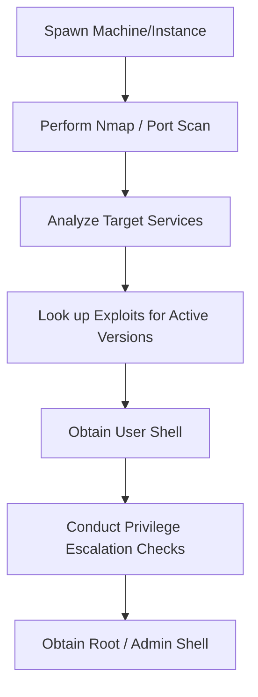

# HackTheBox Playbook

## Challenge Flow


## Recon
1. Ping target IP to verify connection through HTB VPN.
2. Run comprehensive port scan: `nmap -sC -sV -oN nmap_output.txt <target_ip>`.
3. Perform subdirectory discovery on HTTP services.

## Enumeration
- Enumerate SMB, SNMP, SSH, FTP, HTTP, and proprietary services.
- Search ExploitDB or GitHub for target service version numbers.
- Check default credentials for services (e.g. Tomcat, Jenkins, Webmin).

## Decision Tree
```
Is there a web interface?
 ├── Yes -> Run dir_bruteforce.py / search exploits
 └── No -> Enumerate other open ports (SMB, SSH, FTP)
```

## Exploitation Steps
1. Target weakest service/exposed config to gain initial footprint.
2. Deploy reverse shell callback to local machine listener.
3. Stabilize shell session (`python3 -c "import pty; pty.spawn('/bin/bash')"`).
4. Extract user flag from `/user.txt` or Desktop.
5. Identify privilege escalation paths (SUID, sudo permissions, cron jobs, kernel exploits).
6. Exploit privilege path to retrieve root flag from `/root/root.txt`.

## Automation
```bash
# Nmap initial recon command
nmap -p- --min-rate=1000 -T4 -sC -sV -oN nmap_full.txt $TARGET_IP
```

## Common Mistakes
- Tunneling issues: failing to verify the VPN IP connection state before scanning.
- Over-relying on automated tools (like Metasploit) on OSCP-like boxes.
- Forgetting to check configuration files for hardcoded passwords.
