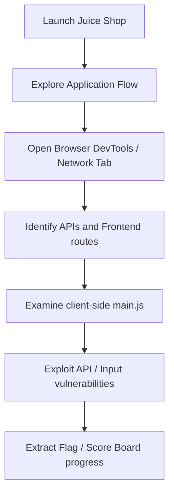

# OWASP Juice Shop Playbook

## Challenge Flow


## Recon
1. Navigate to main UI and create an account.
2. Read main Javascript asset files (`main.js`, `vendor.js`) to extract client routes.
3. Access hidden pages like `/score-board` directly.

## Enumeration
- Map all REST API routes under `/api/` (e.g. `/api/Users`, `/api/Products`).
- Test path traversal on static files or file uploads.
- Analyze cookie headers and storage variables (`localStorage`, `sessionStorage`).

## Decision Tree
```
Is target parameter an API endpoint?
 ├── Yes -> Test parameter tampering / JWT bypasses
 └── No -> Test traditional Web bugs (XSS, SQLi, LFI)
```

## Exploitation Steps
1. Capture HTTP request payloads using Burp or scripts.
2. Test SQL injection on login parameters (`' OR 1=1--`).
3. Tamper with request data to buy products for free or view other users' orders (IDOR).
4. Extract sensitive server keys or local databases.

## Automation
```python
import requests
# Login as admin using SQL Injection
def login_sql_inj(url):
    payload = {"email": "' OR 1=1--", "password": "any"}
    r = requests.post(f"{url}/rest/user/login", json=payload)
    print("[+] Login response:", r.json())
```

## Common Mistakes
- Relying entirely on manual UI tests when API requests bypass frontend logic.
- Ignoring Javascript build files that contain secret routes or administrative APIs.
- Forgetting to test basic validation bypasses on the backend server.
