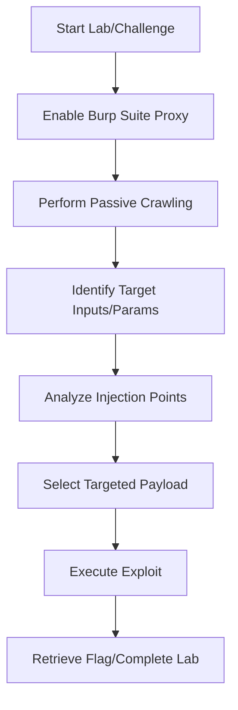

# PortSwigger Playbook

## Challenge Flow


## Recon
1. Crawl website structures using Burp Proxy or crawler tools.
2. Read javascript/source files to find endpoints.
3. Keep track of parameter values in cookies, query parameters, and headers.

## Enumeration
- Identify framework components (e.g. looking at HTTP headers like `X-Powered-By`).
- Map all inputs: forms, headers, file uploads, JSON payloads.
- Test endpoint responses to various HTTP request methods (GET, POST, PUT, DELETE).

## Decision Tree
```
Is target input reflected?
 ├── Yes -> Check for XSS or SSTI
 └── No -> Check for Blind injection (SQLi, SSRF, Command Injection)
```

## Exploitation Steps
1. Capture target request in Burp Repeater.
2. Inject a simple canary payload (e.g., `'` or `${7*7}`).
3. Verify response changes or server behaviors.
4. Scale canary to full exfiltration payload.

## Automation
```python
import requests
# PortSwigger session-maintaining exploit template
def trigger_exploit(url, session_cookie, payload):
    headers = {"Cookie": f"session={session_cookie}"}
    r = requests.post(url, headers=headers, data={"param": payload})
    return r.text
```

## Common Mistakes
- Not matching the active lab cookie, causing payloads to trigger on unauthenticated sessions.
- Using active payloads too fast, causing WAF lockouts.
- Forgetting to URL-encode payloads inside POST/GET variables.
