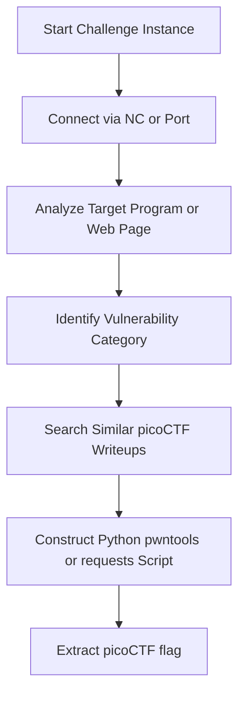

# picoCTF Playbook

## Challenge Flow


## Recon
1. Check challenge description carefully for hints and target environment (OS, arch).
2. Download any provided source code files.
3. Determine target address: URL or Netcat port (`nc saturn.picoctf.net XXXXX`).

## Enumeration
- For Binaries: Run `file`, `checksec`, and `strings` to identify protection mechanisms.
- For Web: Browse resources, check cookie signatures, investigate git repositories (`/.git/`).
- For Crypto: Parse files for public keys, parameters `N`, `e`, `c`, or ciphertext properties.

## Decision Tree
```
Is connection type nc/TCP socket?
 ├── Yes -> Use Pwntools Template
 └── No -> Use Requests / Scanners / Custom scripts
```

## Exploitation Steps
1. Parse raw variables and download resources.
2. Formulate local exploit script against challenge binary.
3. Test locally to ensure consistent exploit state.
4. Point exploit at remote host to print `picoCTF{...}` flag.

## Automation
```python
from pwn import *
# Quick picoCTF nc interaction
def pwn_remote(host, port):
    r = remote(host, port)
    r.recvuntil(b": ")
    r.sendline(b"exploit_payload")
    print(r.recvall().decode())
```

## Common Mistakes
- Hardcoding local paths in scripts when connecting to remote instances.
- Missing small clues hidden inside hints or problem descriptions.
- Assuming remote environment libc matches local environment without checking.
