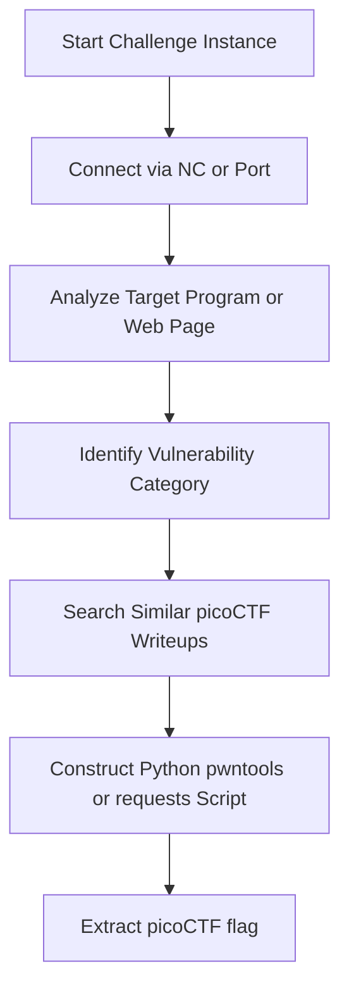

# picoCTF Playbook

## Challenge Flow


## Recon
1. Check challenge description carefully for hints and target environment (OS, arch).
2. Download any provided source code files.
3. Determine target address: URL or Netcat port (`nc saturn.picoctf.net XXXXX`).

## Enumeration
- For Binaries: Run `file`, `checksec`, and `strings` to identify protection mechanisms.
- For Pwn/PIE binaries that echo your input and ask for an address to jump to (`scanf("%lx")` -> function pointer call): run `nm ./vuln | grep -wE "main|win"` for stable compile-time offsets, then leak a code pointer via a format-string in the echoed name (`%p` dump, or positional `%19$p` -> `main+0x41`). Compute `win = leak - leak_slot_off - (main_off - win_off)` (e.g. `leak - 0xD7`) and send it in stage 2. Reuse `scripts/pwn_pie_leak.py`, `payloads/FormatString.txt`, `skills/pwn/PIEBypass.md`. A "Segfault Occurred" reply = wrong address, retry.
- For Web: Browse resources, check cookie signatures, investigate git repositories (`/.git/`).
- For Auth/2FA challenges: inspect leaked DB attachments (`sqlite3 file.db .dump`), crack unsalted hashes offline (hashcat/rockyou), and decode Flask session cookies (signed, not encrypted) to read stored OTPs/roles.
- For IDOR/hashed-profile challenges: log in (check HTML comments for guest creds), read YOUR numeric/role ID from your own profile page, verify the URL token scheme (`md5("your_id")` == your profile token), then enumerate candidate IDs (small ranges; "N employees/users" hints bound the space) requesting each hashed URL — 404 = no user, 200 + "admin" = flag. Reuse `scripts/idor_enumerate.py`.
- For File Upload challenges: probe the filter with small test uploads (`.txt`, `.php`, `.png`, `.phtml`, `.htaccess`) to learn if it is a php-extension BLOCKLIST or a strict image ALLOWLIST. If `.htaccess` is accepted, upload one with `AddType application/x-httpd-php .png` (or `SetHandler` FilesMatch) then a `shell.png` containing PHP; request `shell.png?c=<cmd>` and read flags outside the web root with `../../flag.txt`. Reuse `scripts/htaccess_shell.py` and `skills/web/FileUpload.md`.
- For Crypto: Parse files for public keys, parameters `N`, `e`, `c`, or ciphertext properties.
- For SSH/General Skills boxes: enumerate the user (`id`, `ls -la`) and run `sudo -l` immediately. A `NOPASSWD` grant to an editor/interpreter (emacs/vim/less/python) is a privilege escalation vector - check GTFOBins and prefer non-interactive `--batch`/`-eval` invocations.
- For Encoding/General Skills strings or files: identify the charset (base64/base32/hex/URL), then decode in a loop until plaintext. Strip whitespace (line wrapping) between layers. Reuse `scripts/base64_loop_decode.py`.
- For Raw-Bytes-over-Network challenges ("Send me the HEX BYTE 0xNN N times"): send the ACTUAL bytes (not the ASCII hex string) over a socket in a recv->parse->send loop; append a trailing `\n` for `fgets`/`scanf` readers; stop when a flag prefix appears. Plain Python `socket` replaces pwntools/`nc` when unavailable. Reuse `scripts/bytemancy_solver.py` and `skills/python/RawBytesNetwork.md`.

## SSH Automation
When the challenge provides `ssh -p <port> user@host` + a password and you need non-interactive access (no sshpass on Windows):
```python
import paramiko
c = paramiko.SSHClient()
c.set_missing_host_key_policy(paramiko.AutoAddPolicy())
c.connect('host', port=22, username='user', password='pw')
stdin, stdout, stderr = c.exec_command('sudo -l')   # then run exploit cmd
print(stdout.read().decode())
c.close()
```
See `scripts/ssh_cmd.py`.

## Decision Tree
```
Is connection type nc/TCP socket?
 ├── Yes -> Use Pwntools Template
 └── No -> Use Requests / Scanners / Custom scripts

Given a gibberish string/file (General Skills / Crypto)?
 ├── Identify charset (base64 / base32 / hex / URL)
 ├── Loop-decode until plaintext or a flag prefix appears
 └── If base64 invalid, fall back to base32 -> hex -> URL-decoding

Given a prompt asking for specific HEX bytes over a socket?
  ├── regex byte 0x([0-9A-Fa-f]{2}) + count (\d+) times
  ├── sendall(bytes([b]) * N + b'\n') -> repeat until flag prefix
  └── Use scripts/bytemancy_solver.py

Binary prompts for a name/string then asks "enter the address to jump to"?
  ├── Echo uses printf(user_input)? -> Format string leak (positional %N$p)
  │    ├── Find slot leaking a code pointer (main+0x41 typical) with %p dump / gdb
  │    ├── Compute win via nm offsets: win = leak - leak_off - (main_off - win_off)
  │    └── Send hex(win) at the jump prompt -> flag
  └── Program prints its own address (e.g. "Address of main: %p")? -> compute win directly
```

## Exploitation Steps
1. Parse raw variables and download resources.
2. Formulate local exploit script against challenge binary.
3. Test locally to ensure consistent exploit state.
4. Point exploit at remote host to print `picoCTF{...}` flag.

## Automation
```python
from pwn import *
# Quick picoCTF nc interaction
def pwn_remote(host, port):
    r = remote(host, port)
    r.recvuntil(b": ")
    r.sendline(b"exploit_payload")
    print(r.recvall().decode())
```

## Common Mistakes
- Hardcoding local paths in scripts when connecting to remote instances.
- Missing small clues hidden inside hints or problem descriptions.
- Assuming remote environment libc matches local environment without checking.
